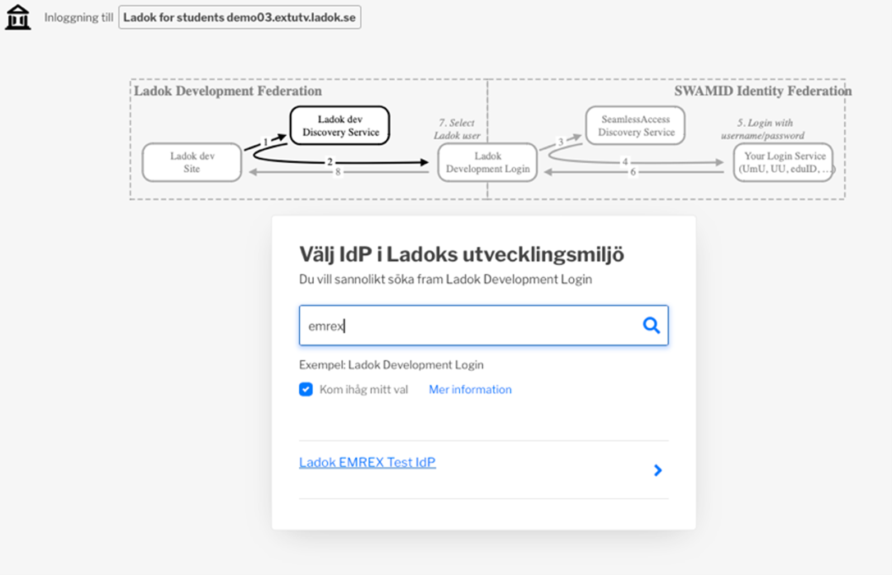
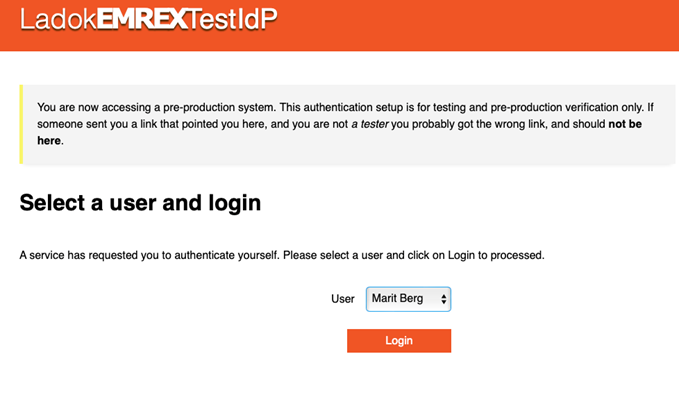
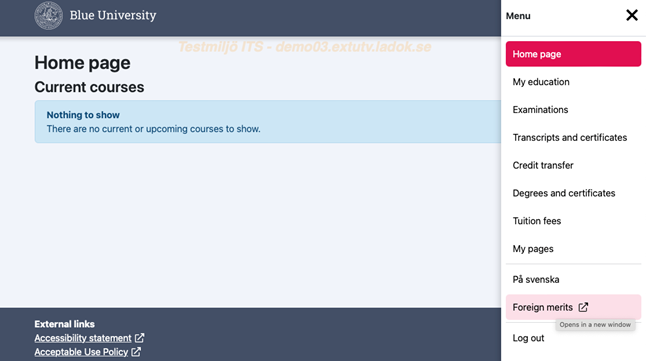
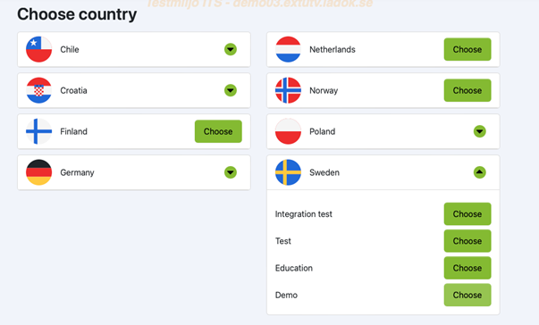
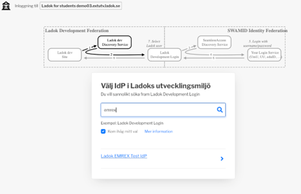
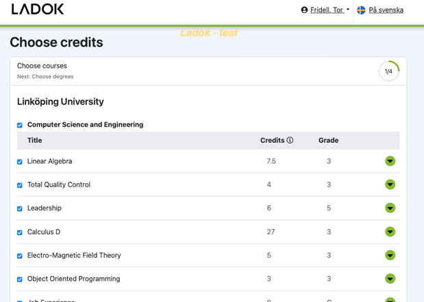
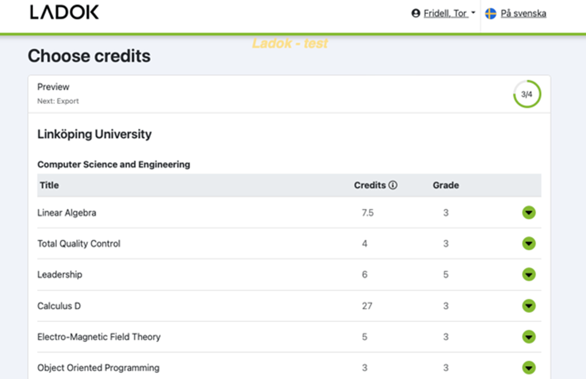

**Accessing EMREX test**

## As a student from Ladok where you want to fetch results from another country (EMREX client)

Adress: <https://demo03.extutv.ladok.se:442/>

1. Select ”Access through your institution” in the first dialogue

2. Type in “EMREX”, you will then see the “Ladok_EMREX_Test_idp which you select

3. Select any of the test persons

4. In the menu in the top right, open the menu and select “In English” first and then “Foreign merits”

5. Click on “Start”

6. Select country and/or single institution

7. Continue with the instructions related to the country you selected

## From a system in another country (EMREX EMP)

Works also from Swedish Client

Adress: [https://demo03.extutv.ladok.se:442/student/ncp/login](https://demo03.extutv.ladok.se:442/student/ncp/login%20)

1. Connect to Swedish testsite (holds anonymous data) by selecting “Demo” in Sweden

2. Select ”Access through your institution” in the first dialogue

3. Type in “EMREX”, you will then see the “Ladok_EMREX_Test_idp which you select

4. Select any of the test persons

5. Choose what credits that should be imported

6. Follow the steps with preview and ending in Export

