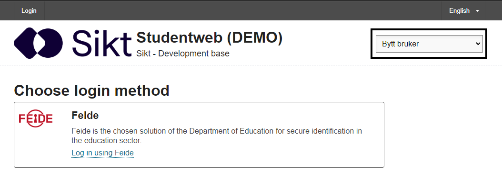
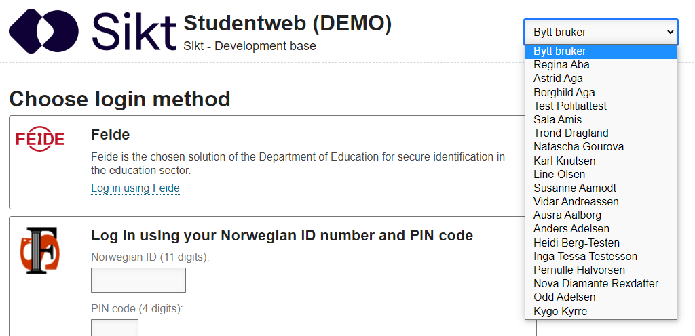
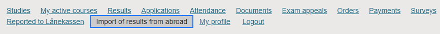
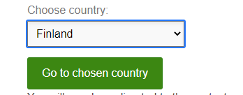
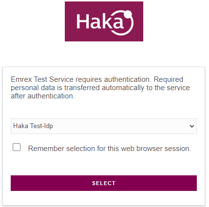
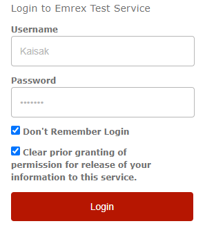
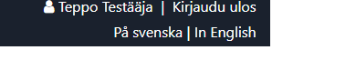
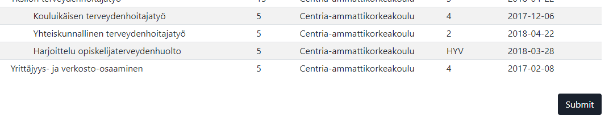
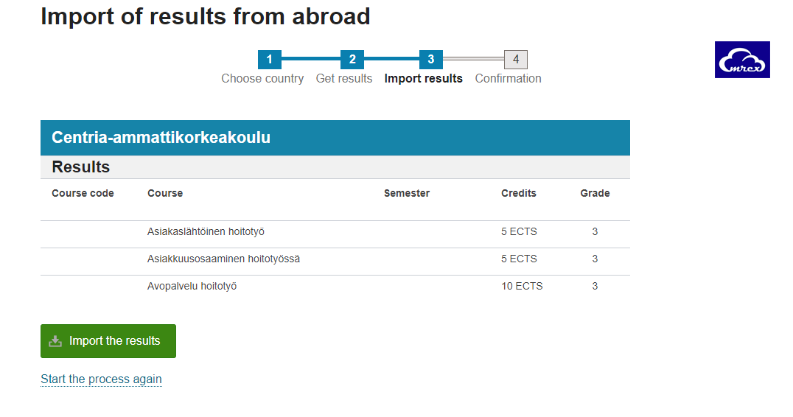
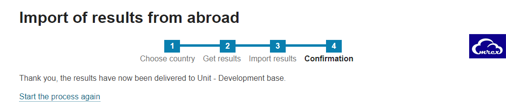

EMREX Demo: Norwegian EMREX client to Finish EMREX Data Access Point
====================================================================

Introduction
------------
This is a short demo of how to import results from the Finnish EMREX Data Access Point (EMP) to the Norwegian EMREX client StudentWeb.  
Note that this document utilizes pre-production environments and can change and be taken down at any time. Before running tests utilizing an EMP or an EMREX client please contact the corresponding partners to make sure the system is stable and avalible at the time of your tests. 

Log in to the client
--------------------
Go to https://fs-demo.uio.no/studentweb/login.jsf?inst=FSUTV. You can change the language of the site if necessary. To change language, look for the dropdown menu on the top right of the application.
We currently don't have any test users avalible to log in through Feide or any other login solutions. We do however have a dropdown list of test users that can be used.

 
Clicking on the drop-down menu will give you a list of test users.

You can use any one of the test users to complete this demo.

Starting the process of importing your results
----------------------------------------------
Once logged in, look at the footer of the application and click the link “Import of results from abroad.”

In the dropdown menu labeled “Choose country” select “Finland” and click the button below named “Go to chosen country.”

The EMREX Data Access Point
---------------------------
When you arrive at the Finish EMP select the organization “Haka Test-Idp” and click “select.” On the login page type in the username and password and click “login.”:  
- Username: Kaisak  
- Password: keränen

If you want to re-run the same test multiple times from start to finnish we recommend to check the checkbox “Don’t remember login.”  
This web-app is in finnish by default, so on the top right of the application click the button “In English.”

 
From this page select what courses you want to transfer and click the button “Send chosen credits.”

 
You will be sent to a page to review your selection. To continue click the button “submit” underneath the data-table previewing your selection of courses.

Coming back to the EMREX client
-------------------------------
After clicking the submit-button you will be redirected back to the EMREX client StudentWeb. On this page you can review the information received and choose whether or not to actually import them. Click the button “Import the results” underneath the data-table previewing your selected courses to import your results. 
 

NOTE If you are using the same users as we are in this document you might see a warning with the following text: “An error has occurred while verifying the results. If you choose to import them, they will need to be verified manually as well.” 
