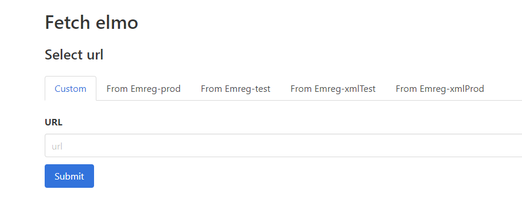
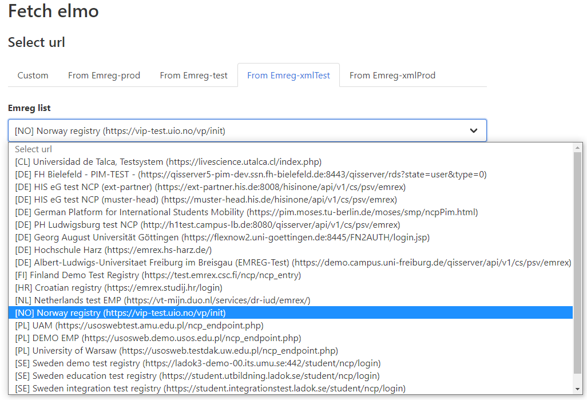
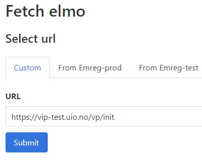
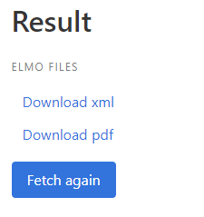

How to demo your EMP from the Norwegian EMREX-test
==================================================

1 Go to EMREX-test and select what instance you want to test
--------------------------------------------------------------
Go to https://emrextest.sandbox.fs-rok.aws.unit.no/emrextest where you will be met by the page shown below. Select one of the 5 available options *Custom*, *From Emreg-prod*, *From Emreg-test*, *From Emreg-xmlTest*, *From Emreg-xmlProd*. 

 
-	Emreg-test: https://emreg.test.usos.edu.pl/ncp-list.json 
-	Emreg-prod: https://emreg.usos.edu.pl/ncp-list.json 
-	Emreg-xmlTest: https://dev-registry.erasmuswithoutpaper.eu/catalogue-v1.xml 
-	Emreg-xmlProd: https://registry.erasmuswithoutpaper.eu/catalogue-v1.xml

2 Find you EMP and select it
------------------------------
Select what instance you want and find you EMP like shown below. When you press the submit button you will be sent to the selected EMP.

 
2.1	using the *Custom* option
---------------------------
The custom option allows you you to test your EMP even when it is not available through any of the other options. This will allow new EMPs to test their client even before they are added to the EWP catalogue.  
Example using the test instance of the Norwegian EMP:

 
3 Returning to EMREX-test
---------------------------
When you return to EMREX-test you will be met with a page like below. This page will let you download the raw XML document created from the EMP as well as download the PDF-file of the ELMO document. 
 

