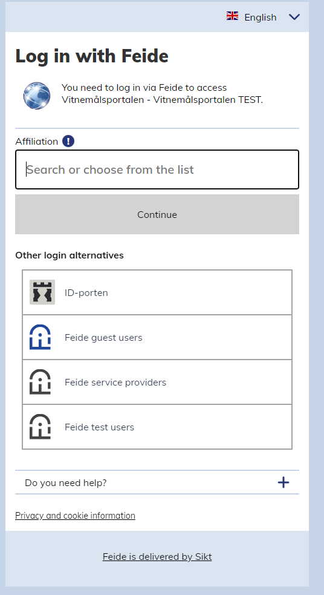
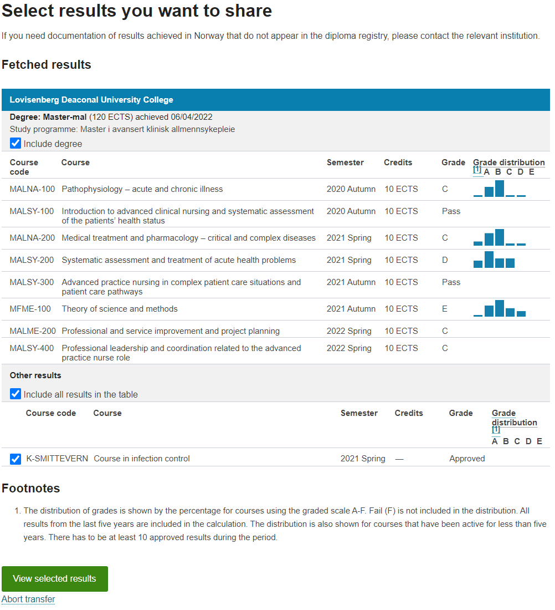

Using the Norwegian EMP to test your EMC
========================================

Introduction
------------
This document will detail how to use the Norwegian EMP to test you own EMC. Note that this will only detail how to use the Norwegian EMP, not the entire EMREX process. To see a full demo of the entire process start to finish, look at the document EMREX_demo_norwegian_EMC_to_finnish_EMP.

The diplomaPortal
----------
In this demo we are using the test instance of the diploma portal: [https://vip-test.uio.no/vp/login](https://vip-test.uio.no/vp/login).

Test users
----------
There are 3 openly available test users to use freely. These test users are available to everyone using Vitnemålsportalen (the Norwegian EMP) so the data of these users might change from day to day or even disappear entirely from one day to the next.

| Username            | Password | Norwegian national identifier |
|---------------------|----------|-------------------------------|
| aaselaila789student | 098asd   | 01826199624                   |
| bengt789student     | 098asd   | 01815895963                   |
| biri789student      | 098asd   | 01820798372                   |

Step 1. Logging in
------------------
When redirected to the Norwegian EMP (Vitnemålsportalen) you will be offered two login options: *ID-porten* and *Feide*.

 
Click the link “Log in using Feide” and you will be redirected to the Feide login page where you will click the button “Feide test users” or search for the affiliation “Feide test users”.

 
After clicking the button you wil be sent to the login page. Type in the username and password of the test user you want to use and click “log in”.

Step 2. Selecting the results you want to transfer to your EMC
--------------------------------------------------------------
After login you will be sent to the selection page. In Norway, if a result of a course you want to share is part of a degree you will have to either share the entire degree or you can’t share the result. Courses that are not a part of a degree can be shared freely. Select what degrees and/or single results you want to share and click the button “View selected results”.

 
Step 3. Confirming selection and returning to your EMC
------------------------------------------------------
After selecting the results, you want to share you will then have to confirm your selection. This is done by checking the checkbox at the bottom of the table previewing your selected results. After you have clicked the button “Transfer records” you will be sent back to your EMC.  
  
Two things to note: 
1.	The text in the checkbox label shows the link that you will be sent back to. Confirm that this is the url of your EMC
2.	The button “Transfer records” might be grayed out for a while even after checking the checkbox. This is due to us disabling this button until the ELMO document is signed. Once signed the button should turn green.

